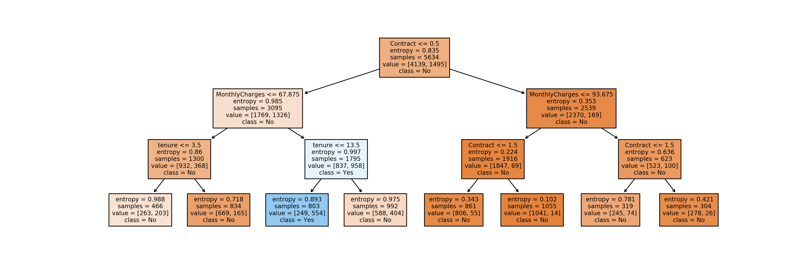
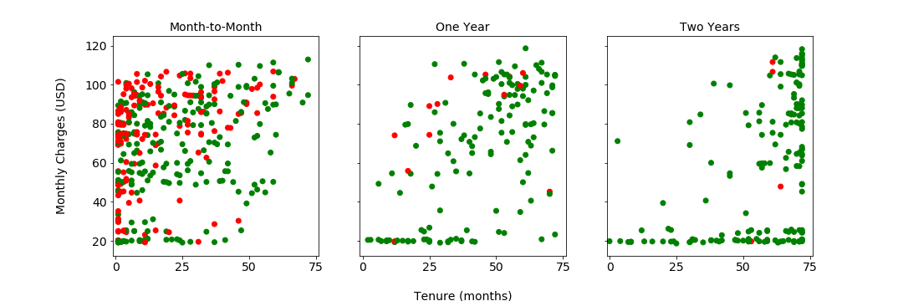

## Project Summary

*Churn* is the measure of how many customers stop using a product. Loss of customers generally results in loss of profit for a business. In contrast, "[increasing customer retention rates by 5% increases profits by 25% to 95%.](https://hbr.org/2014/10/the-value-of-keeping-the-right-customers)" A model that identifies customers who are likely to churn could enable early intervention to prevent loss of business. 

This study uses data on [Telco Customer Churn](https://www.kaggle.com/blastchar/telco-customer-churn), which has 19 features describing customer demographics, subscription services, and account information. By using univariate analysis of categorical and continuous data to eliminate features that do not correlate to churn, the number of features is reduced. The most important 8 features are used to build a decision tree. 

**The decision tree indicates that customers who have a month-to-month contract (Contract <= 0.5) with monthly charges greater than $67.875 and a tenure of fewer than 13.5 months with the company are the most likely to leave.**

Since there are only 3 features that are important for predicting churn, we can visualize them using a series of scatter plots. For each contract length (Month-to-Month, One Year, and Two Years), a scatter plot of monthly charges versus tenure is color-coded so that green dots represent loyal customers and red dots represent customers that left. 

The customers that left (red dots) are primarily in the Month-to-Month plot, especially at low months of tenure and high monthly charges. This visualization supports the decision tree modelling. The visualization also shows a number of red dots for customers on a one-year contract with high monthly charges. 

For more details, check out the [Full Report and Jupyter notebook](https://github.com/MarielleSP/Churn-DecisionTree/blob/main/Churn-DecisionTree.ipynb).
